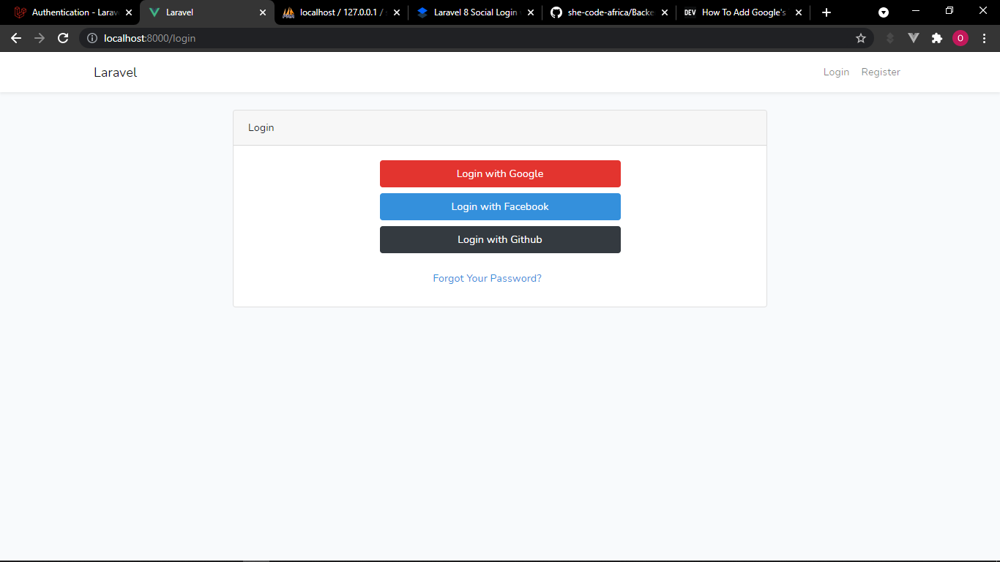

The importance of authentication in software engineering cannot be overemphasized. This article discusses the topic in relation to Laravel. It briefly describes OAuth and its implementation in Laravel.
Here are a few things you'll learn:

- What is OAuth?
- OAuth 1.0 vs OAuth 2.0.
- OAuth server implementation in Laravel(Laravel Passport).
- What is Social Login..
- What is Laravel Socialite.
- How to implement Social Login with Laravel Socialite.

## Introduction

There is a common misconception that OAuth is an Authentication protocol. Although OAuth doesn't provide Authentication, it does provide Authorization.
**Authentication** is the act of validating that users are who they claim by using, for example, a password and username, biometrics, and one-time pins.
In system security, **Authorization** is the process of giving the user permission to access a specific resource or function.
OAuth is utilized in a wide variety of applications, including providing mechanisms for user authentication. This has driven numerous developers and API providers to erroneously conclude that OAuth is itself a confirmation convention and erroneously utilize it as such.

A full authentication protocol will likely tell you a number of attributes about a user, such as a unique identifier, an email address, and whether that user is present in the app, but OAuth does nothing of the sort. It isn't concerned with either the user or their attributes or presence; it simply asks for a token, gets the token, and uses it to request some resources. This is why it is dangerous to use as a form of authentication.
For example, you can tell Facebook that it’s OK for Hashnode.com  to access your profile or post updates to your timeline without having to give Hashnode your Facebook password. This minimizes risk in a major way, therefore if Hashnode suffers a breach, your Facebook password remains safe.

## What Is OAuth?

**OAuth** ***stands for*** **Open Authorization.** OAuth is an open standard for delegating access, commonly utilized as a way for Web clients to allow websites or applications to get to their data on other websites without giving them passwords.

It is a verification convention that permits you to endorse one application interacting with another application on your behalf without giving away your password.

It is neither an API nor a service but an open standard that can be implemented by anyone, which apps can utilize to supply client applications with “secure designated access”. OAuth works over HTTPS and authorizes gadgets, APIs, servers, and applications with access tokens instead of credentials.

## How does OAuth Work?

OAuth fundamentally grants access tokens to be allotted to third-party clients by an authorization server, with the endorsement of the resource owner, and in turn, the clients use these token to access secured data, facilitated by the resource server.

Let’s look at the scenario of trying to sign in with Google(a service provider) on GitHub(a consumer application). First, GitHub seeks permission from Google by requesting a Client key and Secret. This helps Google verify that GitHub has access to request resources. Once its verified, the user is redirected to Google to decide whether to log in. If the user logs in, he or she gives GitHub permission to use his or her resources stored by the service provider(Google). Thereafter, GitHub (the consumer application) obtains an access token for use in making a request to the protected resource on Google(the service provider). Tokens come with access authorization for the API. These authorizations are called scopes, and each token has an authorized scope for each API. GitHub can access Google only to the degree defined in the scope.

## OAuth 1.0 vs. OAuth 2.0

In recent times, when we refer to OAuth, we reference OAuth 2.0 automatically since OAuth 1.0 depreciated a long time ago. OAuth 1.0 was published in April 2010, and OAuth 2.0 was published in October 2012.

OAuth 2.0 is a total modification of OAuth 1.0, excluding nothing and sharing only general goals and user experience. OAuth 2.0 isn't backwards compatible with OAuth 1.0 or 1.1 and ought to be thought of as a totally modern convention. This means that if you build an app with OAuth 2.0, it belongs to 2.0 since 1.0 has depreciated.

### Cryptography

OAuth 1.0 required crypto-implementation and crypto-interoperability. Although it was secure, it was a challenge for numerous developers to implement.

Building a secure OAuth solution is not a simple challenge. Large enterprises joined the OAuth standard body and impacted it in numerous ways. Whereas OAuth 2.0 is much simpler to actualize than OAuth 1.0 and its crypto underpinnings, the new version contains numerous compromises at the security level.

### Clean Separation of Roles

OAuth2 can be characterized as a resource server (API) with an authorization server. This implies that there's a clear division of parts between the server handling the authorization request and the server producing access-control choices based on the response to the authorization request. This separation permits support for more adaptable use cases.

For example, Google’s OAuth 2.0 implementation uses a server at “accounts.google.com” for authorization requests but uses “www.gooogleapis.com” when making requests to the Google+ API.

### Better Support for Non-Browser-Based Applications

This is often the primary feedback against OAuth from client applications that were not browser-based. For case, in OAuth 1.0, desktop applications or versatile phone applications had to coordinate with the user to open their browser to achieve the required benefit, verify the service, and duplicate the token from the benefit back to the application. The limitation here is the user experience. With OAuth 2.0, there are other ways for an application to induce authorization for a client. This was one of the main advantages OAuth2 has over OAuth1. However, abuse of this flows in favor of convenience and ease can lead to insecure implementations of OAuth2.

### Bearer Token vs Access Token

In OAuth1, there are two parts to the access token, a public and a private string. The most common way of getting to OAuth 2.0 APIs is employing a “bearer token”, which acts as the authentication of the API request, sent in an HTTP “Authorization” header. It's an easier way to make API requests since it doesn’t require the cryptographic signing of every request.

The advantage is that it doesn’t require complex libraries to make requests and is much easier for both clients and servers to implement. The drawback is that there's nothing preventing other apps from using a Bearer token if they can get access to it.

Therefore, this is a common criticism of OAuth2. However, if applications properly protect the access tokens under their control, this is not a problem, although technically it is less secure.If your service requires a more secure approach, you can use a different access token type that may meet your security requirements.

### Which is the best,  OAuth1 or OAuth2?

All these stated factors appear indicate that OAuth2 is superior to OAuth1 and that OAuth1 is obsolete. This isn't the case. It is exceptionally uncommon to see a recently developed authorization system utilizing OAuth1.

The major organization that still fully supports OAuth 1.0 is Twitter; they call their version OAuth1.0a. However, when security is concerned, OAuth1 is still reasonable and may be more secure than OAuth2 since it offers extra security on top of TLS-based precautions and creates obstructions in potentially compromising flows.

An existing application that uses OAuth1 likely does not have to be upgraded to OAuth2. New systems that depend on server-to-server authorization may likely use OAuth1 for the extra security. However, use cases that seem advantageous from a separation of concerns, non-browser support, and advancement ought to utilize OAuth2.

## OAuth Server Implementation in Laravel

[Laravel Passport](https://laravel.com/docs/8.x/passport) facilitates full OAuth2 server implementation for Laravel Apps in less time. Developing an OAuth2 server from scratch can be tedious and time-consuming, but Laravel Passport is a local OAuth 2 server for Laravel apps. The Laravel Passport package embodies routes, middleware, and database migrations to develop an authorization server that will return access tokens for giving access permission to server resources. It uses the [League OAuth2](https://github.com/thephpleague/oauth2-server) Server package as a dependency and has a straightforward, easy-to-learn, and easy-to-implement language structure.

## What Is Social Login?

Social login, also called social sign-in or social sign-on, allows users to log in and register with a single click on a client application utilizing their existing accounts from various social service providers.

It is a single sign-on ([SSO](https://auth0.com/docs/configure/sso)) advancement that allows users to verify themselves on diverse applications by connecting through a social media site rather than providing a separate ID and password on each website.

Essentially, it uses data from social networking sites to improve logins on third-party applications. It is designed to simplify the sign-in and registration experience, providing a convenient alternative to obligatory account creation. This basically means that users should be able to sign up or sign in with any of their social accounts.

It can be advantageous for third-party applications that need to get a users’ profile data, such as a profile picture or email address. However, it can be a drawback since it isn't considered a secure method of authentication and should never be used for authentication of any site with any form of sensitive information.

## Social Login in Laravel (Laravel Socialite)

Laravel also provides a basic and helpful way to verify with OAuth providers utilizing [Laravel Socialite](https://laravel.com/docs/8.x/socialite). Socialite currently supports authentication with Facebook, Twitter, LinkedIn, Google, GitHub, GitLab, and Bitbucket.

## How can Social Login be implemented with Laravel Socialite?

In this guide, I’ll be using [Laravel Socialite](https://laravel.com/docs/8.x/socialite) to implement social login for Google, Facebook, and GitHub. This topic will be divided into two sub-sections, as follows.

### Create an Authentication UI Scaffold

### Step 1: Create a new Laravel Project

You can create a new Laravel project via the Composer command or the Laravel installer:

```bash
laravel new project_name   
or
composer create-project laravel/laravel project_name
```

### Step 2: Connect to your database

[Here](https://dev.to/roxie/how-to-connect-laravel-application-to-mysql-database-5han) is an article I wrote that explains how to [connect a Laravel Application to a MySQL database](https://dev.to/roxie/how-to-connect-laravel-application-to-mysql-database-5han).  If you have a different database, make sure to connect it appropriately.

### Step 3: Install Laravel/UI

```bash
composer require laravel/ui
```

### Step 4 : Create a Bootstrap AUTH Scaffold

A bootstrap authentication scaffold provides a UI and basic authentication for registration and login. You can install it with the `Artisan` command:

```bash
php artisan ui bootstrap --auth
```

### Step 5: Install NPM Packages

```bash
npm install
```

### Step 6: Run NPM environment

```bash  
npm run dev
```

### Step 7: Update the Login page

Provide the buttons for users to log in with their social accounts on `resources\views\auth\login.blade.php`.

*Note that we put the URL routes in the login buttons.*

```php
@extends('layouts.app')
@section('content')
<div class="container">
<div class="row justify-content-center">
<div class="col-md-8">
<div class="card">
<div class="card-header">{{ __('Login') }}</div>
<div class="card-body">
 <form method="POST" action="{{ route('login') }}">
     @csrf
    <div class="form-group row">
    <div class="col-md-6 offset-md-3">
      <a href="{{route('login.google')}}" class="btn btn-danger btn-block">Login with Google</a>
      <a href="{{route('login.facebook')}}" class="btn btn-primary btn-block">Login with Facebook</a>
      <a href="{{route('login.github')}}" class="btn btn-dark btn-block">Login with Github</a>
   </div>
   </div>   
</form>
</div>
</div>
</div>
</div>
</div>
@endsection
```

### Step 8: Run the application

You can serve the Laravel application with the following `Artisan Command`:

```bash
php artisan serve
```

### Step 9: Hit this URL on your browser

```bash
http://localhost:8000/login
```

You should be able to view the login page:



### Create Social Login with Socialite

### Step 1: Install the Laravel Socialite package

Use the Composer package manager to add the package to your project's dependencies:

```php
composer require laravel/socialite
```

### Step 2: Set up routes

Since we are dealing with views, our routes will be in `routes\web.php`.

To authenticate users using an OAuth provider, you will need two routes: one for redirecting the user to the OAuth provider and another for receiving the callback from the provider after authentication.

```php
//Google
Route::get('/login/google', [App\Http\Controllers\Auth\LoginController::class, 'redirectToGoogle'])->name('login.google');
Route::get('/login/google/callback', [App\Http\Controllers\Auth\LoginController::class, 'handleGoogleCallback']);
//Facebook
Route::get('/login/facebook', [App\Http\Controllers\Auth\LoginController::class, 'redirectToFacebook'])->name('login.facebook');
Route::get('/login/facebook/callback', [App\Http\Controllers\Auth\LoginController::class, 'handleFacebookCallback']);
//Github
Route::get('/login/github', [App\Http\Controllers\Auth\LoginController::class, 'redirectToGithub'])->name('login.github');
Route::get('/login/github/callback', [App\Http\Controllers\Auth\LoginController::class, 'handleGithubCallback']);
```

### Step 3: Configure service providers

You will need to add credentials for the OAuth providers your application utilizes. These credentials should be in your application's `config/services.php` configuration file before using socialite.

```php
'google' => [
   'client_id' => env('GOOGLE_CLIENT_ID'),
   'client_secret' => env('GOOGLE_CLIENT_SECRET'),
   'redirect' => 'your_redirect_url',
],
'facebook' => [
   'client_id' => env('FACEBOOK_CLIENT_ID'),
   'client_secret' => env('FACEBOOK_CLIENT_SECRET'),
   'redirect' => 'your_redirect_url',
],
'github' => [
   'client_id' => env('GITHUB_CLIENT_ID'),
   'client_secret' => env('GITHUB_CLIENT_SECRET'),
   'redirect' => 'your_redirect_url',
],
```

_Note that the **`redirect`** value should be the callback URL you set at the Service Providers and at your routes._

### Step 4: Set CLIENT_ID and CLIENT_SECRET in the `.env` file

**`CLIENT_ID`** and **`CLIENT_SECRET`** should not be in any public directory, so they should be stored as environment variables.

```php
  GOOGLE_CLIENT_ID=
  GOOGLE_CLIENT_SECRET=

  FACEBOOK_CLIENT_ID=
  FACEBOOK_CLIENT_SECRET=

  GITHUB_CLIENT_ID=
  GITHUB_CLIENT_SECRET=   
```

> **Note that after creating each App on the various Service Providers, this is where the CLIENT_ID and CLIENT_SECRET values should be placed.**

### Step 5: Set up LoginController

`LoginController` is at the `app\Http\Controllers\Auth\LoginController.php` directory. First , let’s define a `_registerOrLoginMethod()`, which will log in returning users or register new users. This takes place when they  are redirected to callback from a successful authentication on the Service Provider.

```php
protected function _registerOrLoginUser($data){
$user = User::where('email',$data->email)->first();
  if(!$user){
     $user = new User();
     $user->name = $data->name;
     $user->email = $data->email;
     $user->provider_id = $data->id;
     $user->avatar = $data->avatar;
     $user->save();
  }
Auth::login($user);
}
```

Furthermore, we can now define the different methods we set in the routes for the different Service Providers:

 ```php
//Google Login
public function redirectToGoogle(){
return Socialite::driver('google')->stateless()->redirect();
}

//Google callback  
public function handleGoogleCallback(){

$user = Socialite::driver('google')->stateless()->user();

  $this->_registerorLoginUser($user);
  return redirect()->route('home');
}

//Facebook Login
public function redirectToFacebook(){
return Socialite::driver('facebook')->stateless()->redirect();
}

//facebook callback  
public function handleFacebookCallback(){

$user = Socialite::driver('facebook')->stateless()->user();

  $this->_registerorLoginUser($user);
  return redirect()->route('home');
}

//Github Login
public function redirectToGithub(){
return Socialite::driver('github')->stateless()->redirect();
}

//github callback  
public function handleGithubCallback(){

$user = Socialite::driver('github')->stateless()->user();

  $this->_registerorLoginUser($user);
  return redirect()->route('home');
}
 ```

The `redirect` method provided by the `Socialite` façade takes care of redirecting the user to the OAuth provider, while the `user` method will read the incoming request and retrieve the user's information from the provider after they are authenticated.

### Step 6: Create an App for Google, Facebook, and GitHub

Here are few clips that briefly describe how to create an App on the different Service Providers, obtain the OAuth **Client_ID and Client_Secret**, and put them in an `.env` file.

- [**Google**](https://vimeo.com/570103885)
- [**Facebook**](https://vimeo.com/570171903)
- [**Twitter**](https://vimeo.com/570175299)

Thereafter , we need to clear the configuration cache since we updated our environment variables.

Use the following `Artisan` command:

```bash
php artisan config:cache
```

### Step 7:  Update migrations for the `users` table

The migrations file is at `database\migrations\2014_10_12_000000_create_users_table.php` the directory. We need to add columns for `provider_id` and `avatar`  in the `up()` method if the user logged in with one of his or her social accounts.

```php
public function up()
{
  Schema::create('users', function (Blueprint $table) {
  $table->id();
  $table->string('name');
  $table->string('email')->unique();
  $table->string('provider_id')->nullable();
  $table->string('avatar')->nullable();
  $table->timestamp('email_verified_at')->nullable();
  $table->string('password')->nullable();
  $table->rememberToken();
  $table->timestamps();
});
}           
```

Now, run the migrations again with this `Artisan` command:

```bash
php artisan migrate:fresh
```

### Step 8:  Add the users’ avatars beside their name in the navbar

When a user logs in with his or her social account, we obtain their username and avatar, along with other credentials.  

We need to display the avatar beside the username after the user logs in successfully. The `nav-item dropdown` in the `resources\views\layouts\app.blade.php` directory will be updated like this:

```php
<li class="nav-item dropdown">
 avatar}}" alt="{{Auth::user()->name}}">
   <a id="navbarDropdown" class="nav-link dropdown-toggle" href="#" 
   role="button" data-toggle="dropdown" 
   aria-haspopup="true" aria-expanded="false" v-pre>
              {{ Auth::user()->name }}
  </a>

 <div class="dropdown-menu dropdown-menu-right" 
       aria-labelledby="navbarDropdown">
  <a class="dropdown-item" href="{{ route('logout') }}" 
     onclick="event.preventDefault();  
       document.getElementById('logout-form').submit();">
            {{ __('Logout') }}
      </a>
  <form id="logout-form" action="{{ route('logout') }}" method="POST" class="d-none">
                               @csrf
  </form>
</div>
</li>        
```

**Hurrah 😎! We are done building 👍. Now, let’s perform some testing and see if it works.**

## Testing

Before testing, here are few important points to note:

- The user selects the social account to log in with and is redirected to the Service Provider.
- After successful authentication on the Service Provider, the user is logged in and redirected to his or her dashboard.
- If the user isn’t registered, he or she will be registered and logged in automatically after successful authentication on the Service Provider because of the `_registerOrLogin()` method we defined in `LoginController`.

**Here is a short clip that describes how to test everything we’ve built so far:**

[**Testing Laravel Socialite**](https://vimeo.com/570198805)

*Note that I’ve used my personal social accounts to test it, and they all have the same email; therefore, I had to delete it from the database before using it again to test another social account.*

## Conclusion

Thank you so much for following along with this guide. I hope it serves you well. The entire code for this is open source and available [here](https://github.com/Roxie-32/laravel_socialite) on [GitHub](https://github.com/Roxie-32/laravel_socialite), so you can check it out for further clarification.

For further information, review the Laravel Socialite [documentation](https://laravel.com/docs/8.x/socialite).

I am open to questions, contributions, and conversations on better ways to implement this, so please use the comment box or DM me [@twitter](https://twitter.com/OlasupoFunke).

Thanks for reading 🤝.
